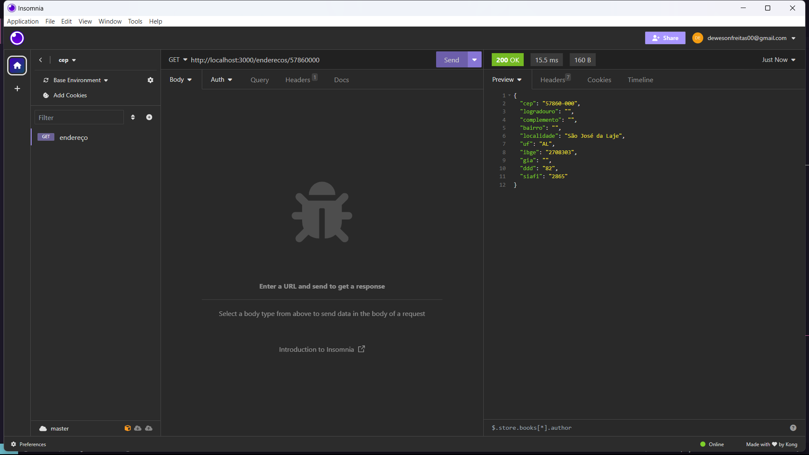

# Título do Projeto

Api para consultar um cep específico e guardá-los no banco de dados.

## Visão Geral

A api ultiliza a biblioteca "utils-playground", onde o usuário digita o cep desejado, a api primeiramente busca no banco de dados da mesma, não encontrando, ela irá buscar na biblioteca "utils-playground" e cadastrando em seguida no banco de dados o cep desejado.

## Como Executar o Projeto
Clone o repositório, e instale as dependências.

### Requisitos

- Dependência 1: "express"
- Dependência 2: "utils-playground"
- Dependência 3: "nodemon"

### Configuração

1. Clone o repositório: `git clone https://github.com/Deverson-Freitas/Api-de-cep.git`
2. Navegue até o diretório: `cd nome-do-projeto`
3. Instale as dependências: `npm install` ou `yarn install`

### Uso

1. link da api: `http://localhost:3000/enderecos/"cep desejado"` 

## Exemplo de ultilização

## Licença

Este projeto é licenciado sob a Licença MIT - veja o arquivo [LICENSE](LICENSE) para mais detalhes.